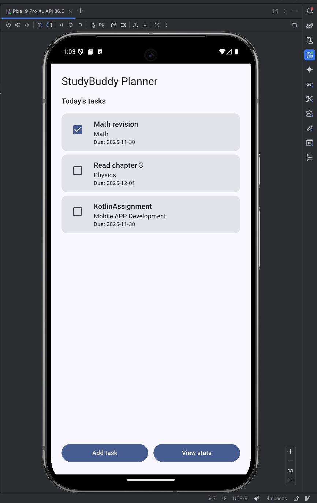
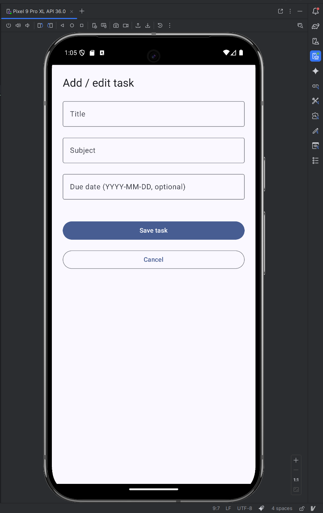
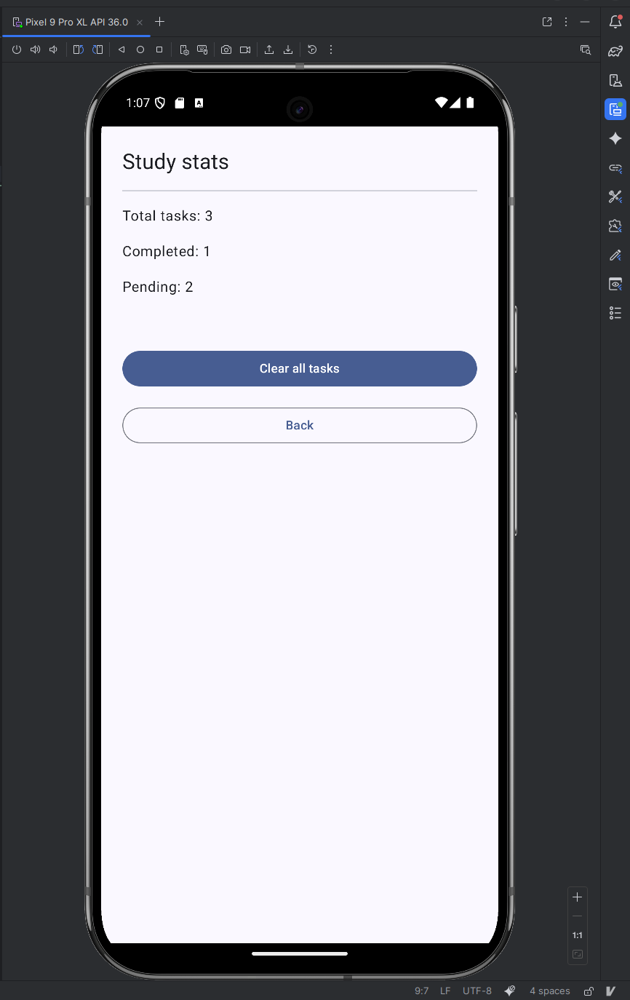

# StudyBuddyPlannerApp

StudyBuddy Planner is a simple Android app that helps students keep track of their study tasks.  
You can add tasks, mark them as completed, and see basic statistics about your progress.

---

## Features

- [x] Home screen with a list of study tasks
- [x] Add new tasks with title, subject, and due date
- [x] Mark tasks as completed using a checkbox
- [x] Stats screen showing total / completed / pending tasks
- [x] Clear all tasks from the stats screen
- [x] Local persistence using DataStore (tasks are restored after app restart)
- [x] Basic validation for empty fields and invalid date format
- [ ] Edit existing task (planned / optional)

---

## Tech Stack

- **Language:** Kotlin  
- **UI:** Jetpack Compose + Material 3  
- **Architecture:** MVVM  
- **State management:** `ViewModel` + `StateFlow` + `collectAsState()`  
- **Storage:** DataStore (JSON serialization via `TaskRepository`)  
- **Navigation:** `navigation-compose` with a `NavHost`  
- **Testing:** JUnit unit test for task statistics (`calculateTaskStats`)

---

## Screens

The app has at least three main screens (as required in the assignment):

1. **Home Screen**
   - Shows a list of tasks.
   - Each task displays title, subject, and due date.
   - Checkbox to mark a task as done / not done.
   - Buttons to navigate to:
     - **Add task** screen
     - **Stats** screen

2. **Add / Edit Task Screen** (currently used for “Add” only)
   - Text fields for:
     - Title
     - Subject
     - Due date (`YYYY-MM-DD`, optional)
   - Validation:
     - Title and subject cannot be empty.
     - Date must be in valid format if provided.
   - “Save task” button adds a new task via `TaskViewModel.addTask(...)`.
   - “Cancel” button goes back to the previous screen.

3. **Stats Screen**
   - Shows:
     - Total number of tasks
     - Completed tasks
     - Pending tasks
   - Values are calculated using the pure function `calculateTaskStats(tasks)`.
   - “Clear all tasks” button calls `viewModel.clearAll()` and also persists the change.
   - “Back” button returns to the Home screen.

---

## Architecture Overview

- **Data layer**
  - `Task.kt` – data class for a study task:
    - `id: Long`
    - `title: String`
    - `subject: String`
    - `date: LocalDate`
    - `isDone: Boolean`
  - `TaskRepository.kt` – handles saving and loading a list of tasks from **DataStore**.
    - Exposes a `tasksFlow: Flow<List<Task>>`.
    - Provides a `suspend fun saveTasks(tasks: List<Task>)`.

- **Domain / ViewModel layer**
  - `TaskViewModel.kt`:
    - Takes a `TaskRepository` in the constructor.
    - Holds `_tasks: MutableStateFlow<List<Task>>` and public `tasks: StateFlow<List<Task>>`.
    - Subscribes to `repository.tasksFlow` in `init {}` and:
      - Loads stored tasks if available.
      - On first run, seeds DataStore with sample tasks.
    - Functions:
      - `addTask(title, subject, date)`
      - `toggleDone(id: Long)`
      - `clearAll()`
      - Internal `updateTasks(newList: List<Task>)` which updates StateFlow and calls `repository.saveTasks(...)`.
    - Pure helper:
      - `calculateTaskStats(tasks: List<Task>): Triple<Int, Int, Int>`  
        returns `(total, done, pending)`.

- **UI / Navigation layer**
  - `MainActivity.kt`:
    - Creates `TaskViewModel` via `TaskViewModelFactory(TaskRepository(applicationContext))`.
    - Sets `StudyBuddyPlannerAppTheme` as global theme.
    - Hosts a `NavHost` with three routes:
      - `"home"` → `HomeScreen(...)`
      - `"addEdit"` → `AddEditTaskScreen(...)`
      - `"stats"` → `StatsScreen(...)`
  - Composables:
    - `HomeScreen(...)` – shows tasks, uses `collectAsState()` on `viewModel.tasks`.
    - `TaskCard(...)` – one card row with checkbox + task info.
    - `AddEditTaskScreen(...)` – form with validation.
    - `StatsScreen(...)` – subscribes to `tasks` and uses `calculateTaskStats(...)`.

- **Theme**
  - `ui/theme/Theme.kt`, `Color.kt`, `Type.kt`:
    - Material 3 theme.
    - Light and dark color schemes.
    - Dynamic color enabled on Android 12+.

---

## Screenshots

_(Replace the file names with your actual screenshot paths in the repo.)_

- **Home screen**  
  

- **Add task screen**  
  

- **Stats screen**  
  

---

## License

MIT

## Notes

Some parts of this project were created with AI assistance (ChatGPT), under my guidance.  
All code has been reviewed and tested by me before submission.


## How to Run

1. **Clone the repository**

   ```bash
   git clone https://github.com/AhnafTahmid98/StudyBuddyPlannerApp.git
   cd StudyBuddyPlannerApp
